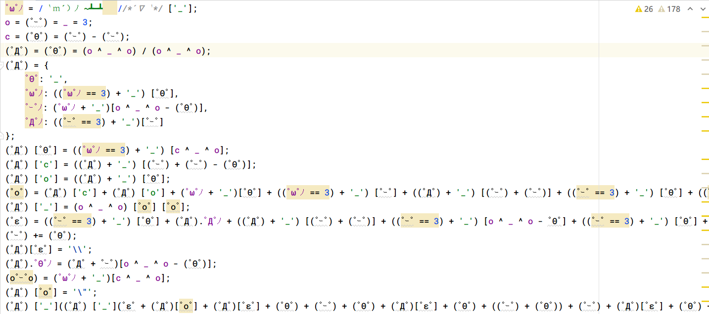

# 第一题：这也能矿？

> 题目ID:1  题目地址：[ 第1题地址](https://security.bilibili.com/crack1/index)


## 首要目标：夺旗

访问链接后，我们看到的是一个网站后台管理的登陆界面。我们可以得到以下线索：

- 标题为：ezintruder。代表 easy intruder。可以根据 intruder 联想到暴力破解。因为Burp Suite中就有intruder模块。
- username输入框的placeholder为admin。可以暂时认为username就是admin。
- password输入框placeholder为8颗星星。可以暂时认为密码为8位，字符为数字、字母、或一些字符的组合。


简单测试了登陆按钮的点击，可以发现这个login逻辑是损坏的，原因在于login button点击逻辑的js代码被编码加密了。

---

审查网页源码，在网页中找到 https://security.bilibili.com/static/core.js 这个奇怪的 js 混淆文件，里面内容为加密后的颜文字。



推测加密算法为 AAencode。因此采取任意一个解码器 [AAdecode](https://cat-in-136.github.io/2010/12/aadecode-decode-encoded-as-aaencode.html) 进行解码，解码后得到core.js的明文代码。

解密之后，源码结构如下：

```js
function SHA256(s) {...}

$(function () {
    $("#btn").click(function () {...});
})
```

显然，定义了一个sha256的工具类，以及使用JQuery定义了btn的点击时间监听。

我们开始进一步仔细阅读btn点击后的代码运行逻辑：

```js
let username = document.getElementById('username').value.trim();
let password = document.getElementById('password').value.trim();
// let nonce = parseInt(Math.random()*9 + 23);
let nonce = parseInt(Math.random()*100 + 9);
let random = document.getElementById('random').value.trim();
console.log(nonce);
for (var i = 0; i < Math.pow(2, 255); i++) {
    let mystr = username + password + random + i.toString();
    var s256 = SHA256(mystr);
    var s256hex = parseInt(s256, 16)
    if (s256hex < Math.pow(2, (256 - nonce))) {
        console.log("success!");
        console.log(mystr);
        console.log(s256);
        console.log(s256hex);
        $.ajax({
           // omit
        });
        break;
    }
}
```

在这里，我们看到四个字段：

- username：htm中的用户名。
- passoword：html中的密码。
- nonce：一个随机值。在信息安全中，Nonce是一个在加密通信只能使用一次的数字。
- random：这个值是UUID的形式，隐藏在html代码中。而且会随着sessionid的变化而改变。

我们继续往下看，发现是一个CPU密集型(caculate heavy) 的for 循环，里面这句：

```js
let mystr = username + password + random + i.toString();
```

我们可以将这里的字符串连接拆成两部分：

- username + password + random => 用户数据
- i => 一个计数器，从0开始不断递增。

接着：

```js
var s256 = SHA256(mystr);
var s256hex = parseInt(s256, 16)
```

这部分代码是hash运算，最后得到一个16进制的字符串。哈希原理我们这里不用深究。

然后对这个hash结果进行条件约束判定，

- 如果满足条件，那么就进行HTTP请求login；
- 否则计算器+1，继续运算。

这里，hash计算满足的条件是：s256hex < Math.pow(2, (256 - nonce))，当nonce越大时，Math.pow(2, (256 - nonce))这个值就越小，可以理解为条件就越苛刻，要计算的时间开销就越高。

经过简单的取值尝试，发现nonce=9时很快就能算出满足的值。

接着往下看ajax里面的请求逻辑。

```js
$.ajax({
    url: '/crack1/login',
    type: 'POST',
    data: JSON.stringify({
        'username': username,
        'password': password,
        'nonce': nonce,
        'random': random,
        'proof': i.toString(),
    }),
    dataType: 'json',
    contentType: "application/json",
    success: function (data) {
        console.log(data);
    },
    error: function (data) {
        console.log(data);
    }
});
```

这是一个普通的请求。data字段有五个name-value，现在分析它们的取值范围：

- username： admin
- password：未知。
- nonce: 9
- random：对于特定的一次session，该值是固定的。
- proof：由hash条件算出。

可以得知，目前这里只有password的值是无法实际确定的。所以我们应该先尝试一些简单的password值，观察返回的结果。

---

将解密后的 core.js 通过创建浏览器代码片段的形式添加到 chrome，并hardcode一些password值来进行请求，观察结果。

> 以Chrome为例，Snippets添加方式：打开控制台 -> Sources -> Snippets -> New Snippets

简单尝试了一些简单的password值，发现陷入了 POW(proof of work) 的报错泥潭。

```js
{msg:"you don't proof your work"}
```

如果密码正确的话，应该会是succes之类的响应消息吧。那么，我们现阶段的目标都是攻克弱密码的难题了。

常规做法是在网上寻找合适的弱密码字典，因为我们大概率确定为8位，于是可以大幅度缩小范围。

假设我们找到了一些合适的密码字典，那么现在我们需要做的是：

1. 对搜集的密码字典进行预处理，挑选出精确8位的密码。
2. 对8位密码的文本文件进行处理，导出为一个json array，这样复制到js代码中就能直接调用。
3. 对原来的core.js代码逻辑进行修改，添加一个外层for loop来暴力破解密码。


上面的login函数就是封装了之前的登陆逻辑，这里注意：

- 需要将这个login逻辑视为同步请求。
- login函数需要返回一个标识来表示是否登录成功。
- 对于一次密码尝试，要小心地处理网络错误导致的失败，例如受到风控策略限制，某个请求会随机失败。这些因为其他原因而导致的失败，
最直接的处理是包含一个while循坏进行重试。而人工介入记录的方式过于劳累，不推荐。

这里不再贴出login函数代码的具体实现，可以参考对应的github仓库。

---

暴力破解现场截图如下：


如果拿到了类似正确的msg信息，那会跳出所有循坏，并打印正确密码。成功的密码是 Aa123456，刚好8位。

但是此时响应为 `{msg: "success"}`，并没有看到任何关于flag的文本信息。

既然不在response中，还能藏到哪里呢？只有响应headers了吧。

在响应headers中，找到了想要的字段：

```http
x-bilictf-flag1: flag1{0358b7e0-9f2e-455e-af25-fba0ae3fcb75}
x-bilictf-hidden: maybe something in back2.png:)
```

得到了flag1和对其他题目的线索。此外，在网页的main.css文件中，发现了第四题的线索：
```css
body {
    margin: 0;
    padding: 0;
    width: 100%;
    height: 100%;
    /*where hidden crack4*/
    background: url("./img/back.png");
    ...
}
```

很好，拿下第一题。


## 其他可能的解决方式

- 可以使用 ReRes 修复破损的core.js。本质是使用本地文件来替换某个请求路径的文件，示例配置：

    ```
    https://security.bilibili.com/static/core.js => file:///D:/Code/MyGithubProjects/bilibili-2022-sec1024/1/core.js
    ```

   这个方法可以替代 browser snippets 的做法。本质上没有区别，都是在浏览器中执行自定义的JS逻辑。是可以work的。

- 本地IDE编辑Node语言脚本，将login的js逻辑移植到本地，在IDE中运行。

  本地运算可以有效利用其他语言的优势和计算资源优势，例如多线程模型，代码提示友好，调试方便。

- 本地IDE编辑Python语言脚本，将login的js逻辑移植到本地，在IDE中运行。

  正确设置cookie到headers中依旧失败。

- 使用 Burp Suite的Intruder模块进行暴力枚举攻击。

  

  上图为在 burp suitre中使用comparer进行对比。绿色行代表login succes。红色行代表登陆失败。


上面的思路中，除了浏览器原生请求模式，其他方式在个人简单复现中都失败了，猜测可能和请求库的session配置有关。因此，稳妥的做法是在浏览器中进行夺旗。


## trouble shooting

对于已经获取过flag的sessionid，重复请求会提示:

```json
{"msg": "you already have flag"}
```

清空 security.bilibili.com域名下的 sessionid，重试即可。


## 小结

这个题目首先从core.js的编码混淆入手，解码得出明文core.js。然后自定义字段来进行http请求，暴力破解弱密码。

关键词：aaencode、intruder、PoW、sha256、blockchain。


## 参考

- [区块链之工作量证明，挖矿是什么？](https://zhuanlan.zhihu.com/p/33114775)
- [How to use Burp Suite's Intruder](https://www.youtube.com/watch?v=nC9D1ES-nmo)
- [burpsuite扩展之ip rotate](https://www.ddosi.org/ip-rotate/)
- [axios-extensions](https://github.com/kuitos/axios-extensions)
- [How to Retry Requests Using Axios](https://javascript.plainenglish.io/how-to-retry-requests-using-axios-64c2da8340a7)
- [ReRes](https://github.com/annnhan/ReRes)

