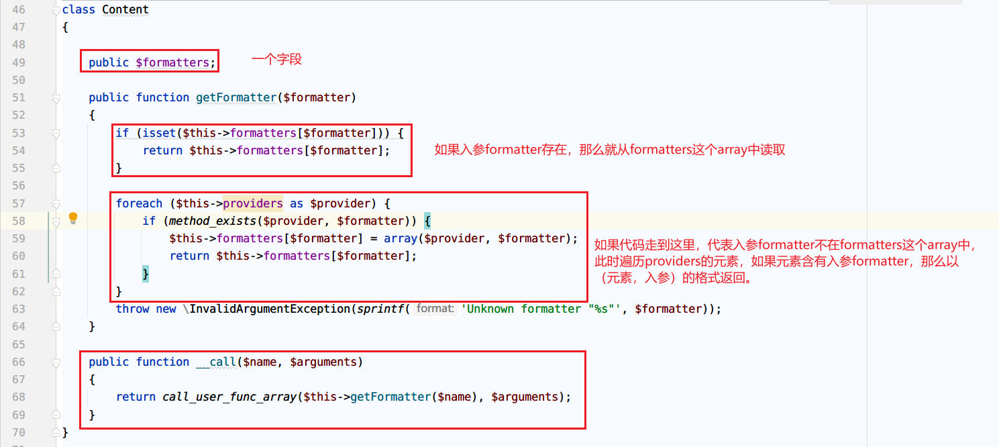

# 第二题：巧妙的POP链

> 题目ID:2  题目地址：[ 第2题地址](http://42.192.54.239/index.php)


## 首要目标：夺旗

访问 http://42.192.54.239/index.php 得到的是 upupup!，猜测是上传文件。

那么需要猜测上传点，例如，upload.html这类API端口。

一番尝试之后，得到以下API：

- upload.html => 上传入口
- upload.php => 代码源文件

对于 upload.html，简单地上传一个正常的 jpg 图片，结果返回了在服务器保存后的地址：

```
success save in: upload/20221024131623622.jpg
```

对于 upload.php ，我们可以下载下来，阅读源码。


### upload.php


- 文件大小限制，没什么特别的。
- 文件后缀名白名单。只要文件后缀名正确即可。
- 移动temp文件到新路径，重命名文件名，这个文件名格式基本锁死。

目前看不到任何的明显漏洞。

---

那就继续往GET方法的处理逻辑来读。


这里，我们注意到file_exists() 方法可能存在phar反序列化漏洞。

这个漏洞具体是：file_exists() 会在phar文件反序列化时将phar文件中的metadata反序列化。在php低于8.0版本中会存在，8.0+被修复。

关于phar的格式，可以查看 [phar的格式约定](https://www.php.net/manual/zh/phar.fileformat.phar.php):


但是，对于如何构造出这个phar的POP链，目前线索还是不够的。因此需要阅读 5d47c5d8a6299792.php 寻找更多线索。

可以利用 http://42.192.54.239/upload.php?c= 链接形式读取 5d47c5d8a6299792.php 源码内容。


### 5d47c5d8a6299792.php

在这个文件中，首先发现以下内容。

```php
// flag in /tmp/flag.php
```

那我们赶紧探测这个文件是否存在：

```
http://42.192.54.239/upload.php?c=/tmp/flag.php
```

得到页面回应为：

```
file exists
```

很好。我们发现了目标。

那么接下来需要仔细阅读 5d47c5d8a6299792.php 的源码，寻找能够将 /tmp/flag.php 文件打印出来的机会。

---

分析类结构：


一共4个类，分别是修饰器、动作、内容、显示。

在跃跃欲试写代码之前，我们先冷静下来，先阅读整个类的实现细节。

---

下面阅读每个类的细节。

**Modifier**


调用形式：$modifier()。暂时没发现有什么特别的作用。

---

**Action**


发现了疑似POP链调用终点的方法。

---

**Content**



这个类定义了一个字段formatters，而在getFormatter($formatter)方法中，提供了一种非常灵活的获取formatter元素的机制。

此外，这里发现了保底方法调用，也即是__call()。它会在 $content实例调用一个未定义的实例方法时被调用。

假设foo是一个函数名，那么：

```php
$content -> foo($args) => $content -> __call(foo,$args) 
```

__call() 内部实现中，它使用 `call_user_func_array($this->getFormatter($name), $arguments);` 将请求转发给了getFormatter函数。也就是 ：

````php
$content -> foo($args) => $content -> __call(foo,$args) => getFormatter(foo)($args)
````

这个 getFormatter(foo)($args) 可操作空间就很大了。

---

**Show**


这个类中，我们发现了POP的入口，因为`__wakeup`或者`__unserialize`这类魔术方法在反序列化时能够自动触发。

并且确定了source字段是$show实例，我们思路到达了__toString的内部实现中。

对于str这个属性，我们可以仔细思考：

**假设：如果使得 str = `$content`：**

而`$content`没有reset定义，那么经过跳板函数__call()，我们需要导航回 $show的reset方法。这里可以确定：

```php
$content->providers = [$show,];
```

而reset方法中，使用了reader ->close()，因为所有类都没有显式定义close方法，我们唯一前进的方向只能是$content的跳板函数

__call()。那么这里，确定了reader属性为 $content，要执行 \$content 的close方法。

我们的思路目前停在了`$content -> __call(close) =>...=> getFormatter(close)($args)`

- 在 `$content->formatters` 中提供close属性作为key，value为array($action, 'run')的话，触发会是这样

  `getFormatter(close)($args)` => `$action.run()`，显然这就是我们想要的。

- 在 `$content->providers ` 中提供close属性的话会怎么样？由于provider从调用形式来看要求provider元素是类实例，例如$show ，因此不适合。

现在我们走完了所有的链式调用，并给出了理论上可行的解决方式：

```php
$content->providers = [$show,];
$content->formatters = array('close' => array($action, 'run'));
```

这里就展示完整的代码，如果需要的话请查阅github仓库。

---

最后，还有一个需要注意的地方，Action类中两个字段都是保护的，因此构造时需要手动定义构造函数。

```php
class Action
{
    protected $checkAccess;
    protected $id;

    public function __construct($checkAccess, $id)
    {
        $this->checkAccess = $checkAccess;
        $this->id = $id;
    }
}
```

在构造函数中进行字段设置。


## 探索

本地调用所写的生成phar的php文件，这里是phar.php，得到一个phar文件，将后缀名改为.gif即可。

在 http://42.192.54.239/upload.html 中上传后，将反馈的 upload/20221031224429833.gif 构造为

http://42.192.54.239/upload.php?c=phar://upload/20221031224429833.gif，访问后拿到

```
/**
* bilibili@2022.
* Congratulations! This is The Flag!
* Auth: K3iove@github 
* Repo: 1024-cheers
* @link https://security.bilibili.com/
* @license https://www.bilibili.com/
*/
flag2{PhAr_The_bEsT_Lang}
```

这里得到flag2，以及新的线索：一个github用户。https://github.com/K3iove/1024-cheers

访问后发现有一个 1024-cheers 仓库，在仓库的  README 文件中

```
1024-cheers
welcome to bilibili 2022!
plz enjoy our game
api test workspace : bilibili-1024-cheers :)
good luck & have fun
```

这一句话比较可能是提示：api test workspace : bilibili-1024-cheers :)。

最后，在postman的workspace中找到 [bilibili-1024-cheers](https://www.postman.com/galactic-station-839513/workspace/bilibili-1024-cheers/request/14460980-ebd7e1f1-0237-43fc-956d-da4c4699fc1b) ，并得到一个get方法的URL:http://101.132.189.74/index 。

访问该URL获取到如下响应：

```json
{
  "msg": " /etc/server.go"
}
```

这就是第5题的线索。


## 小结

这题考查了php低于8.0版本的phar反序列化的漏洞，通过径向设计的POP链，触发一系列方法调用，最终将需要的flag文件打印出来。

题目考查的范围很具体，因此基本不存在其他解法，就是phar反序列化。

关键词：php、phar、deserialize。


## 参考

- [初识phar反序列化&&复现](https://www.cnblogs.com/BOHB-yunying/p/11504051.html)
- [Phar反序列化学习](https://cloud.tencent.com/developer/article/1740539)
